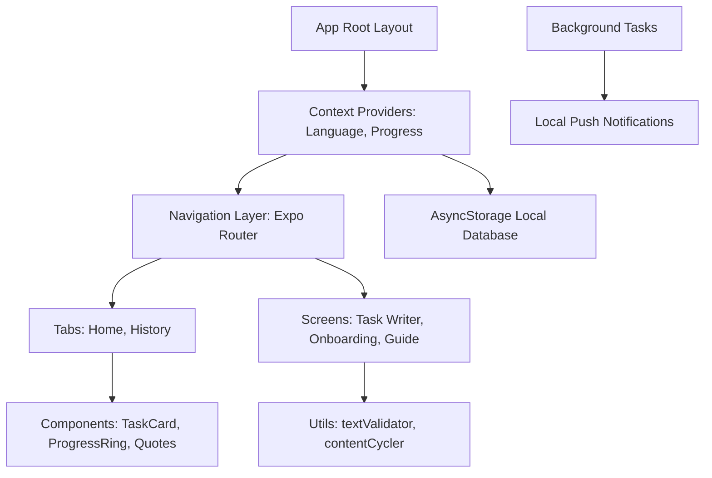

# 369 Niyyah — Complete Technical Documentation

## 1. Executive Summary
**369 Niyyah** is a beautifully crafted, bilingual (English & Bengali) mobile application built with React Native and Expo. It creatively combines the popular 369 manifestation method with the Islamic concept of *Niyyah* (Intention). The app guides users to set and write their core intentions consistently throughout the day (Morning: 3 times, Noon/Afternoon: 6 times, Night: 9 times) over a 369-day journey. It functions primarily offline via local storage and uses local push notifications, with an ad monetization layer utilizing Google AdMob.

## 2. Project Structure
The application uses Expo Router for file-based navigation and NativeWind for Tailwind styling.

* **`/` (Root)**: Contains configuration files (`package.json`, `app.json`, `tsconfig.json`, `tailwind.config.js`, `metro.config.js`, `babel.config.js`).
* **`app/`**: Expo Router entry points and layouts.
  * **`_layout.tsx`**: The root layout wrapping the app in context providers (Theme, Language, Progress, Toast, Error Boundary).
  * **`(tabs)/`**: The bottom tab navigation structure. Contains `index.tsx` (Dashboard) and `history.tsx`.
  * **`task/[slot].tsx`**: Dynamic route handling the writing interface for specific time slots (morning, noon, night).
  * **`guide.tsx`, `onboarding.tsx`**: Static instructional and entry-point screens.
* **`components/`**: Reusable React Native UI components.
  * *UI Layout*: `Accordion.tsx`, `BottomSheet.tsx`, `TaskCard.tsx`.
  * *Feedback & Effects*: `Toast.tsx`, `ConfettiBurst.tsx`, `AnimatedSplash.tsx`, `ErrorBoundary.tsx`.
  * *Feature/Domain*: `Achievements.tsx`, `CalendarDay.tsx`, `JourneyProgressRing.tsx`, `DailyQuote.tsx`, `RepetitionCounter.tsx`.
  * *Monetization*: `AdBanner.tsx`, `AdBanner.web.tsx`.
* **`contexts/`**: React Context providers for global state.
  * `LanguageContext.tsx`: Manages i18n and currently active language.
  * `ProgressContext.tsx`: Core engine tracking daily completions, streaks, and overall progression using AsyncStorage.
* **`data/`**: Static datasets for Quotes and Affirmations in English and Bengali.
* **`i18n/`**: Translation dictionary index and files (`en.ts`, `bn.ts`).
* **`types/`**: Global TypeScript definitions (`index.ts`).
* **`utils/`**: Core logic, utilities, and helper functions.
  * *Business Logic*: `timeSlotManager.ts`, `contentCycler.ts`, `achievements.ts`, `textValidator.ts`.
  * *Services*: `notifications.ts`, `notificationAnalytics.ts`, `notificationContent.ts`, `backgroundTasks.ts`, `logger.ts`.
  * *Ads*: `adConfig.ts`, `useInterstitialAd.ts`.
  * *UI Helpers*: `animations.ts`, `cn.ts` (tailwind merge), `fonts.ts`, `theme.ts`, `useStaggeredEntry.ts`.

## 3. Technology Stack
* **Framework**: React Native 0.81.5 with Expo SDK 54.
* **Routing**: Expo Router v6.
* **Language**: TypeScript v5.9.
* **Styling**: NativeWind v4 & Tailwind CSS v3.
* **Animations**: React Native Reanimated v4, Expo Haptics.
* **Storage**: `@react-native-async-storage/async-storage`.
* **Monetization**: `react-native-google-mobile-ads`.
* **Notifications/Background Work**: `expo-notifications`, `expo-task-manager`, `expo-background-fetch`.

## 4. Architecture Overview
The application follows a **Monolithic Client-Side Architecture** with heavy emphasis on the **Context API** for state management and **File-based Routing** (Expo Router).

## 5. Entry Points & Application Bootstrap
* **Entry Point**: `app/_layout.tsx` is the root layout invoked by `expo-router/entry`.
* **Bootstrap Sequence**:
  1. `SplashScreen.preventAutoHideAsync()` holds the native splash screen.
  2. The `RootLayout` component initiates font loading and ad initialization (`initializeAds()`).
  3. `configureNotificationHandler()` and `registerBackgroundFetchAsync()` are invoked outside the React lifecycle.
  4. Context providers (`LanguageProvider`, `ProgressProvider`) are mounted. These providers read initialization states from `AsyncStorage`.
  5. The UI renders the custom `AnimatedSplash` while fonts load, gracefully transitioning to the requested route via `Stack`.

## 6. Module / Component Reference
* **`app/_layout.tsx`**: Wraps app with ErrorBoundary, Providers, registers notification listeners, manages custom animated splash screen.
* **`app/(tabs)/index.tsx`**: Main dashboard rendering progress ring, today's task cards, daily quote, and achievements.
* **`app/(tabs)/history.tsx`**: Displays a calendar view showing past completed/missed days.
* **`app/task/[slot].tsx`**: The core interactive screen where the user types out their affirmation for a specific slot. Utilizes `textValidator.ts` and `RepetitionCounter.tsx`.
* **`app/onboarding.tsx`**: First launch carousel requesting notification permissions and explaining the app logic.
* **`app/guide.tsx`**: Static informational screen describing the 369 method and usage.
* **`components/TaskCard.tsx`**: Visual card indicating if a slot (Morning/Noon/Night) is pending, locked, complete, or active.
* **`components/JourneyProgressRing.tsx`**: SVG-based animated ring displaying progress over the 369-day journey.
* **`components/AdBanner.tsx`**: Wraps the AdMob banner.
* **`contexts/LanguageContext.tsx`**: Loads persisted language (`en`/`bn`), exposes `t()` function for translation lookups, and provides `setLanguage`.
* **`contexts/ProgressContext.tsx`**: Tracks the user's start date, maps dates to completions (`DailyProgress` object), computes streaks, calculates elapsed days, and handles the "first launch" flag.
* **`utils/timeSlotManager.ts`**: Handles the complex logic of effective days. For example, 12 AM to 5 AM is considered "Night of the previous day".
* **`utils/textValidator.ts`**: Provides character-level string comparison (ignoring case and punctuation) to validate user typing against the target affirmation.
* **`utils/contentCycler.ts`**: Uses deterministic hashing based on the `elapsedDay` index to retrieve the correct quote and affirmation for the current day, ensuring both cycle appropriately.
* **`utils/notifications.ts`**: Calculates precise future timestamps for morning (9 AM), noon (2 PM), and night (8 PM) reminders, scheduling local push notifications up to 14 days in advance.
* **`utils/backgroundTasks.ts`**: Re-schedules local notifications dynamically in the background to ensure they don't run out.
* **`utils/useInterstitialAd.ts`**: Hook to preload and show interstitial ads, implementing a daily frequency cap (`MAX_INTERSTITIALS_PER_DAY`).

## 7. Data Models & Schemas
Stored via JSON in `AsyncStorage`:
* **`PersistedData` (ProgressContext)**
  * `startDate`: `string` (YYYY-MM-DD format indicating journey start).
  * `dailyProgress`: `Record<string, DailyProgress>`. Keys are local date strings (YYYY-MM-DD).
  * `startTimestamp`: `number` (optional, for precise time tracking).

* **`DailyProgress` (Types)**
  * `morning`: `boolean`
  * `noon`: `boolean`
  * `night`: `boolean`

* **`TimeSlot`**: Union `'morning' | 'noon' | 'night'`

## 8. API Reference
The application is **100% Offline-First** and does not communicate with a proprietary backend API. The only external network requests are made by:
1. **Google Mobile Ads SDK**: Fetching Banner and Interstitial Ads.
2. **Expo Updates**: Checking for OTA updates (configured via `eas.json`).

## 9. State Management
* **Language State**: Handled by `LanguageContext`. Saved in AsyncStorage under `@niyyah_369_language`.
* **Progress State**: Handled by `ProgressContext`. Saves a monolithic JSON object under `@niyyah_369_progress`. Any task completion triggers a state update and asynchronous save to storage.
* **Derived State**: Variables like `totalElapsedDays`, `trueStreak`, and `isTodayComplete` are calculated using `useMemo` based on the loaded `dailyProgress` and `startDate` to avoid redundant computations.

## 10. Configuration & Environment
Environment variables are prefixed with `EXPO_PUBLIC_`.
* `EXPO_PUBLIC_USE_TEST_ADS`: Boolean string to force AdMob test IDs.
* `EXPO_PUBLIC_AD_BANNER_ID`: Production AdMob Banner ID.
* `EXPO_PUBLIC_AD_INTERSTITIAL_ID`: Production AdMob Interstitial ID.
* `app.json` contains native configuration, permissions (`SCHEDULE_EXACT_ALARM`), and app identifiers (`com.niyyah369.app`).
* A custom Expo plugin `withRemovePermissions.js` actively strips `READ_EXTERNAL_STORAGE` and `WRITE_EXTERNAL_STORAGE` from the final Android manifest to enforce strict privacy.

## 11. External Services & Integrations
* **Google AdMob**: Integrated via `react-native-google-mobile-ads`. Handles monetization through Adaptive Banners on the dashboard and Interstitials triggered after completing a task slot.

## 12. Authentication & Security
* **No Authentication**: The application does not require user accounts. All data is scoped to the local device.
* **Security Considerations**:
  * No sensitive PII is collected or transmitted.
  * Redundant Android storage permissions are explicitly stripped during the build process to minimize the attack surface and comply with strict Play Store policies.

## 13. Build, Test & Deployment
* **Dependency Installation**: Uses Bun (`bun install`).
* **Local Development**: Run `bun start` to launch the Expo development server.
* **Testing**: Run `bun test` to execute the native Bun test runner. Test files include `__tests__/utils/contentCycler.test.ts`, `utils/textValidator.test.ts`, and `utils/timeSlotManager.test.ts`.
* **Build/Deployment**: Managed via Expo Application Services (EAS). Configuration exists in `eas.json` for development, preview, and production profiles. Uses `expo updates` for Over-The-Air deployment.
* **Web Artifacts**: `vercel.json` maps `/(.*)` to `assets/privacy-policy.html` to serve static policy files via Vercel for app store compliance.

## 14. Known Issues & Technical Debt
* **Performance Note in ProgressContext**: The `badges` array derived from `dailyProgress` uses `useMemo`, however, parsing the entire `dailyProgress` dictionary every time a single day's status changes might present a slight performance bottleneck towards the end of the 369 days.
* **TODO**: Rescheduling feature from notification action `'snooze'` is stubbed out in `app/_layout.tsx` but lacks implementation.
* The file `.eslintrc.js` is outdated (v10 flat config compatibility issue), meaning `bun x eslint .` might fail unless executed with compatibility flags.

## 15. Glossary
* **Niyyah**: Islamic concept of intention, the motivation behind an action.
* **369 Method**: A manifestation practice involving writing a desire 3 times in the morning, 6 times in the afternoon, and 9 times at night.
* **Effective Day**: Due to the nature of the application, a "day" is defined from 05:00 AM to 04:59 AM the next morning, meaning actions performed at 2 AM count towards the previous calendar day.

## Extended Module / Component Reference Supplement
Here is the exhaustive list of all 52 source files discovered and analyzed:

**App Router (`app/`):**
- `app/_layout.tsx`: Root layout, providers, fonts, and initialization.
- `app/guide.tsx`: Guide screen explaining usage and methodology.
- `app/onboarding.tsx`: Entry tutorial and permission request screen.
- `app/(tabs)/_layout.tsx`: Bottom Tab Navigator configuration.
- `app/(tabs)/history.tsx`: Calendar view history screen.
- `app/(tabs)/index.tsx`: Dashboard and main progress screen.
- `app/task/[slot].tsx`: Writing interface for morning/noon/night slots.

**Components (`components/`):**
- `components/Accordion.tsx`: Reusable expandable UI component.
- `components/Achievements.tsx`: Horizontal scroll list of unlocked/locked badges.
- `components/AdBanner.tsx`: AdMob banner wrapper.
- `components/AdBanner.web.tsx`: Web stub for banner ad.
- `components/AnimatedSplash.tsx`: Custom entrance animation with SVG particles.
- `components/BottomSheet.tsx`: Draggable, animated bottom sheet using Reanimated.
- `components/CalendarDay.tsx`: Interactive single-day view component for history.
- `components/ConfettiBurst.tsx`: Celebration particle effect overlay.
- `components/DailyQuote.tsx`: Card displaying current cycled quote.
- `components/ErrorBoundary.tsx`: React error boundary catching render crashes.
- `components/JourneyProgressRing.tsx`: SVG circular progress indicator.
- `components/RepetitionCounter.tsx`: Dots indicating current write repetition out of total required.
- `components/TaskCard.tsx`: Time slot card displaying status and locking logic.
- `components/Toast.tsx`: Global animated notification toaster.

**Contexts (`contexts/`):**
- `contexts/LanguageContext.tsx`: i18n manager and provider.
- `contexts/ProgressContext.tsx`: Core engine and state manager for daily persistence.

**Data & i18n (`data/`, `i18n/`):**
- `data/affirmations.ts`, `data/affirmations_bn.ts`: 41-day cycle text datasets.
- `data/quotes.ts`, `data/quotes_bn.ts`: Display quotes datasets.
- `i18n/en.ts`, `i18n/bn.ts`, `i18n/index.ts`: UI string translations.

**Types (`types/`):**
- `types/index.ts`: Central interface definitions (`DailyProgress`, `TimeSlot`, etc).

**Utils (`utils/`):**
- `utils/achievements.ts`: Logic to calculate badge unlocking.
- `utils/adConfig.ts`, `utils/adConfig.web.ts`: Initialization logic for Google AdMob.
- `utils/animations.ts`: Reusable Reanimated configurations (springs, timings).
- `utils/backgroundTasks.ts`: TaskManager hooks for background execution.
- `utils/cn.ts`: Classname merging for NativeWind styling.
- `utils/contentCycler.ts`: Deterministic hashing to map `elapsedDay` to content arrays.
- `utils/fonts.ts`: Typography family resolution helper.
- `utils/logger.ts`: Centralized console wrapper.
- `utils/notificationAnalytics.ts`: Tracker for user interaction times.
- `utils/notificationContent.ts`: Strings for push notification payloads.
- `utils/notifications.ts`: Push scheduling and permission logic.
- `utils/textValidator.ts`: Character sequence validation and normalization logic.
- `utils/theme.ts`: Tailwind configuration constants exported for JS access.
- `utils/timeSlotManager.ts`: Local time logic dictating day rollovers and slot limits.
- `utils/useInterstitialAd.ts`, `utils/useInterstitialAd.web.ts`: Hook for managing full-screen ad frequency.
- `utils/useStaggeredEntry.ts`: Reanimated hook for list item entry delays.
